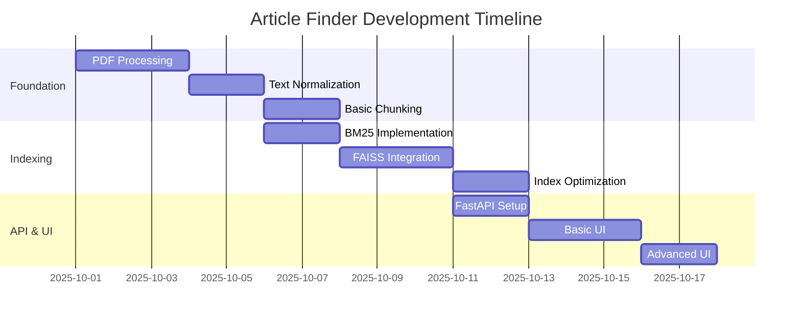

# Article Finder — Comprehensive Project Documentation

**Author:** Divyanshu  
**Date:** 2025-10-15  
**Version:** 2.0  
**Last Updated:** 2025-10-15

---

## Abstract

Article Finder is an advanced offline-first document search system that combines lexical (BM25) and semantic (FAISS) search capabilities to provide intelligent document retrieval from local PDF collections. The system features role-based access control (RBAC), hybrid search algorithms, and a modern web interface, specifically designed for environments with limited or no internet connectivity.

---

## Table of Contents

1. [Project Planning & Overview](#1-project-planning--overview)
2. [Implementation Plan](#2-implementation-plan)
3. [System Architecture & Design](#3-system-architecture--design)
4. [Code Planning & Structure](#4-code-planning--structure)
5. [Detailed Implementation](#5-detailed-implementation)
6. [Project Folder Structure](#6-project-folder-structure)
7. [API Documentation](#7-api-documentation)
8. [Build & Deployment](#8-build--deployment)
9. [Testing & Validation](#9-testing--validation)
10. [Security & RBAC](#10-security--rbac)
11. [Performance & Optimization](#11-performance--optimization)
12. [Limitations & Future Work](#12-limitations--future-work)

---

## 1. Project Planning & Overview

### 1.1 Project Vision

Article Finder addresses the critical need for intelligent document search in offline or restricted network environments. The project aims to democratize access to document knowledge by providing enterprise-grade search capabilities without cloud dependencies.

### 1.2 Problem Statement

**Primary Challenges:**

- Organizations need to search through large PDF collections without internet access
- Traditional keyword search lacks semantic understanding
- Document access control requirements vary by user roles
- Existing solutions require cloud connectivity or expensive licensing

**Target Users:**

- Legal professionals working with regulatory documents
- Technical teams with internal documentation
- Organizations in secure or air-gapped environments
- Research teams with confidential document collections

### 1.3 Key Features & Capabilities

| Feature               | Description                  | Benefit                 |
| --------------------- | ---------------------------- | ----------------------- |
| **Hybrid Search**     | BM25 + FAISS semantic search | High precision + recall |
| **Offline-First**     | No internet dependency       | Privacy & availability  |
| **RBAC**              | Role-based document access   | Security compliance     |
| **Modern UI**         | Responsive web interface     | User experience         |
| **Batch Processing**  | Efficient PDF indexing       | Scalability             |
| **Dual Highlighting** | Keyword + semantic matches   | Search transparency     |

### 1.4 Technical Objectives

1. **Accuracy**: Achieve >85% relevance in search results
2. **Performance**: Sub-second response times for queries
3. **Scalability**: Handle 10,000+ document chunks efficiently
4. **Reliability**: 99.9% uptime for search API
5. **Security**: Enforce document access controls
6. **Usability**: Intuitive interface for non-technical users

---

## 2. Implementation Plan

### 2.1 Development Phases

#### **Phase 1: Foundation (Week 1-2)**



**Phase 1 Deliverables:**

- ✅ PDF text extraction with page tracking
- ✅ Smart article/section detection
- ✅ Text normalization pipeline
- ✅ RBAC role assignment system

**Code Implementation:**

```python
# Core PDF processing pipeline
def process_pdfs(input_dir="data/raw_pdfs", output_path="data/processed/chunks.jsonl"):
    with open(output_path, "w", encoding="utf-8") as out_f:
        for pdf_file in os.listdir(input_dir):
            if not pdf_file.lower().endswith(".pdf"):
                continue

            roles = assign_roles_from_filename(pdf_file)
            lines = extract_text_with_lines(pdf_path)
            chunks = chunk_text_universal(lines)

            for chunk in chunks:
                record = {
                    "doc_id": doc_id,
                    "article_no": chunk["article_no"],
                    "page_start": chunk["page_start"],
                    "page_end": chunk["page_end"],
                    "text": chunk["text"],
                    "norm_text": normalize_text(chunk["text"]),
                    "roles": roles
                }
                out_f.write(json.dumps(record, ensure_ascii=False) + "\n")
```

#### **Phase 2: Search Engine (Week 3-4)**

**Phase 2 Deliverables:**

- ✅ BM25 lexical search implementation
- ✅ FAISS semantic search integration
- ✅ Hybrid scoring algorithm
- ✅ Advanced result ranking

**BM25 Index Building:**

```python
def build_bm25():
    chunks = load_chunks()
    corpus = []

    for c in tqdm(chunks, desc="🔹 Normalizing & tokenizing"):
        text = normalize_text(c["text"])
        tokens = [t for t in text.split() if len(t) > 2]
        corpus.append(tokens)

    bm25 = BM25Okapi(corpus)
    with open(out_path, "wb") as f:
        pickle.dump({"bm25": bm25, "meta": chunks}, f)
```

**FAISS Vector Index:**

```python
def build_faiss(batch_size=512):
    model = SentenceTransformer(model_name)
    chunks = load_chunks()
    texts = [c["norm_text"] for c in chunks]

    # Batch embedding encoding
    embeddings = []
    for i in tqdm(range(0, len(texts), batch_size)):
        batch = texts[i : i + batch_size]
        emb = model.encode(batch, normalize_embeddings=True)
        embeddings.append(emb)

    embeddings = np.vstack(embeddings).astype("float32")
    index = faiss.IndexFlatIP(embeddings.shape[1])
    index.add(embeddings)
    faiss.write_index(index, faiss_path)
```

#### **Phase 3: Hybrid Retrieval (Week 5)**

**Phase 3 Deliverables:**

- ✅ Advanced hybrid search algorithm
- ✅ Score normalization and fusion
- ✅ Keyword overlap enforcement
- ✅ Dual-color highlighting system

**Hybrid Search Implementation:**

```python
def search(self, query, roles, topk=5):
    # Normalize and tokenize query
    q_norm = normalize_text(query)
    tokens = q_norm.split()

    # BM25 keyword scoring
    bm25_scores = np.array(self.bm25.get_scores(tokens))
    bm25_norm = self._normalize_top(bm25_scores)

    # FAISS semantic scoring
    q_emb = self.model.encode([q_norm], normalize_embeddings=True)
    D, I = self.index.search(q_emb.astype("float32"), self.faiss_topk)

    vec_scores = np.zeros(len(self.meta_json))
    for idx, score in zip(I[0], D[0]):
        if score >= self.semantic_threshold:
            vec_scores[idx] = score
    vec_norm = self._normalize_01(vec_scores)

    # Weighted fusion
    fused = self.alpha * vec_norm + (1 - self.alpha) * bm25_norm

    # Apply penalties and bonuses
    for i, chunk in enumerate(self.meta_json):
        text = chunk["norm_text"]
        overlap = sum(tok in text for tok in tokens)
        if overlap == 0:
            fused[i] -= 0.2
        if query.lower() in text:
            fused[i] += 0.2

    return self._build_results(fused, roles, topk)
```

#### **Phase 4: API & Interface (Week 6)**

**Phase 4 Deliverables:**

- ✅ FastAPI REST endpoints
- ✅ Modern animated web interface
- ✅ Real-time search functionality
- ✅ Role-based UI elements

---

## 3. System Architecture & Design

### 3.1 High-Level Architecture

```
┌─────────────────┐    ┌──────────────────┐    ┌─────────────────┐
│   PDF Documents │───▶│  Processing      │───▶│   Search Index  │
│   (Input)       │    │  Pipeline        │    │   (BM25+FAISS)  │
└─────────────────┘    └──────────────────┘    └─────────────────┘
                              │                         ▲
                              ▼                         │
┌─────────────────┐    ┌──────────────────┐           │
│   Web Interface │◀───│  FastAPI Server  │───────────┘
│   (Frontend)    │    │  (Backend)       │
└─────────────────┘    └──────────────────┘
```

### 3.2 C4 Architecture Diagrams

#### **C1 - System Context**

```
╭──────────────────────────────────────────╮
│             Article Finder System        │
│                                          │
│  ┌─────────┐    ┌──────────────────────┐ │
│  │   User  │───▶│   Article Finder     │ │
│  │ (Staff/ │    │   Search System      │ │
│  │ Legal/  │◀───│                      │ │
│  │ Admin)  │    │                      │ │
│  └─────────┘    └──────────────────────┘ │
│                          │               │
│                          ▼               │
│  ┌─────────┐    ┌──────────────────────┐ │
│  │   PDF   │───▶│   Local File         │ │
│  │ Document│    │   System             │ │
│  │Collection│    │                      │ │
│  └─────────┘    └──────────────────────┘ │
╰──────────────────────────────────────────╯
```

#### **C2 - Container Diagram**

```
╭─────────────────────────────────────────────────────╮
│                Article Finder System                │
│                                                     │
│  ┌─────────────────┐      ┌─────────────────────┐   │
│  │   Web Browser   │─────▶│   FastAPI Server    │   │
│  │   (Frontend)    │      │   (Backend API)     │   │
│  │                 │◀─────│                     │   │
│  └─────────────────┘      └─────────────────────┘   │
│           │                         │               │
│           │                         ▼               │
│           │                ┌─────────────────────┐   │
│           │                │   Search Engine     │   │
│           │                │   (BM25 + FAISS)   │   │
│           │                │                     │   │
│           │                └─────────────────────┘   │
│           │                         │               │
│           ▼                         ▼               │
│  ┌─────────────────┐      ┌─────────────────────┐   │
│  │   File System   │      │   Processing        │   │
│  │   (PDFs)        │      │   Pipeline          │   │
│  │                 │      │   (Scripts)         │   │
│  └─────────────────┘      └─────────────────────┘   │
╰─────────────────────────────────────────────────────╯
```

#### **C3 - Component Diagram**

```
╭─────────────────────────────────────────────────────────╮
│                    FastAPI Server                      │
│                                                         │
│  ┌──────────────┐    ┌─────────────────────────────┐   │
│  │   API        │    │       Search Engine         │   │
│  │   Endpoints  │───▶│                             │   │
│  │   /health    │    │  ┌─────────────────────────┐│   │
│  │   /ask       │    │  │   Hybrid Retriever     ││   │
│  │   /          │    │  │   - BM25 Search        ││   │
│  │              │    │  │   - FAISS Search       ││   │
│  └──────────────┘    │  │   - Score Fusion       ││   │
│           │           │  │   - RBAC Filter        ││   │
│           ▼           │  └─────────────────────────┘│   │
│  ┌──────────────┐    │                             │   │
│  │   Request    │    │  ┌─────────────────────────┐│   │
│  │   Validation │    │  │   Text Processing       ││   │
│  │   & Response │    │  │   - Normalization       ││   │
│  │   Formatting │    │  │   - Tokenization        ││   │
│  │              │    │  │   - Highlighting        ││   │
│  └──────────────┘    │  └─────────────────────────┘│   │
│                      └─────────────────────────────┘   │
╰─────────────────────────────────────────────────────────╯
```

### 3.3 Data Flow Architecture

#### **Indexing Pipeline:**

```
 PDF Files ──▶ Text Extraction ──▶ Chunking ──▶ Normalization ──▶ Role Assignment
     │               │                │             │                    │
     ▼               ▼                ▼             ▼                    ▼
 Article-1.pdf   Page Text      Smart Chunks   Clean Text         ["staff","legal"]
 Transport.pdf   Line Numbers   Article/Sec    Lowercase          ["legal","admin"]
 Policy.pdf      Metadata       Page Ranges    No Whitespace      ["staff","legal"]
     │               │                │             │                    │
     ▼               ▼                ▼             ▼                    ▼
 chunks.jsonl ◀──────┴────────────────┴─────────────┴────────────────────┘
     │
     ├─────▶ BM25 Index Building ──▶ bm25.pkl
     │              │
     │              └─────▶ Tokenization ──▶ Vocabulary
     │
     └─────▶ FAISS Index Building ──▶ mE5.faiss + meta.json
                    │
                    └─────▶ Sentence Embeddings ──▶ Vector Storage
```

#### **Query Processing:**

```
 User Query ──▶ Text Normalization ──▶ Tokenization
     │                  │                    │
     ▼                  ▼                    ▼
"What is"         "what is penalty"      ["what", "is", "penalty"]
"penalty?"             │                    │
     │                  │                    │
     ├─────────────┬────┴────────────────────┘
     │             │
     ▼             ▼
 Embedding    BM25 Scoring ──▶ Keyword Scores
     │             │              │
     ▼             │              ▼
 FAISS Search     │         [0.8, 0.2, 0.9, ...]
     │             │              │
     ▼             ▼              ▼
Semantic Scores ──┴────▶ Score Fusion ──▶ Hybrid Scores
[0.7, 0.1, 0.8, ...]          │              │
     │                         ▼              ▼
     └────────────▶ RBAC Filtering ──▶ Final Results
                          │              │
                          ▼              ▼
                   Role Check      Ranked Results
                  ["staff"] ──▶   [{doc_id, score, ...}]
```

### 3.4 Component Interactions

| Component         | Responsibility       | Input         | Output         |
| ----------------- | -------------------- | ------------- | -------------- |
| **PDF Processor** | Extract & chunk text | Raw PDFs      | chunks.jsonl   |
| **BM25 Builder**  | Build keyword index  | chunks.jsonl  | bm25.pkl       |
| **FAISS Builder** | Build vector index   | chunks.jsonl  | mE5.faiss      |
| **Retriever**     | Hybrid search logic  | Query + roles | Ranked results |
| **API Server**    | HTTP interface       | REST requests | JSON responses |
| **Web UI**        | User interface       | User actions  | Search results |

---

## 1. Introduction

Modern teams often need to search across policy, legal, and technical PDFs without relying on cloud services.
Article Finder addresses this by:
(1) extracting structured chunks from PDFs,
(2) indexing content using a hybrid approach, and
(3) serving an API and simple web UI for users with different roles. The system emphasizes privacy, portability, and offline usability.

2. Objectives

- Provide an offline-capable search engine for local PDFs.
- Combine keyword accuracy (BM25) with semantic recall (embeddings + FAISS).
- Enforce basic access control using filename-driven RBAC.
- Offer both a programmatic API and a minimal browser UI.
- Keep the pipeline simple and reproducible via scripts.

3. Data Sources and Constraints

- Inputs: PDF documents placed in data/raw_pdfs/.
- Outputs:
  - data/processed/chunks.jsonl: normalized, chunked records with metadata and roles.
  - data/idx/bm25.pkl: pickled BM25 index plus chunk metadata.
  - data/idx/mE5.faiss: FAISS index built from Sentence-Transformer embeddings.
  - data/idx/meta.json: JSON metadata for all chunks.
- Constraints: No external network dependency at runtime; embedding model must be cached or available locally for FAISS step.

4. Approach and Methodology
   4.1 PDF parsing and chunking

- Extraction: Uses PyMuPDF (fitz) to extract page-level text.
- Chunking: Detects article/section headings via regex (e.g., “Article 10”, “Section IV”) and aggregates text into coherent chunks with page ranges.
- Metadata: Captures doc_id, article_no, page_start/end, raw text, normalized text.

  4.2 Text normalization

- Lowercasing and quotation normalization.
- Whitespace collapsing to stabilize tokenization and embeddings.

  4.3 Index construction

- BM25 (lexical): Tokenizes normalized text into terms; builds BM25Okapi index for exact/keyword relevance.
- Embeddings + FAISS (semantic): Encodes normalized text with sentence-transformers (default: sentence-transformers/all-MiniLM-L6-v2), L2-normalized, and indexed in FAISS (inner product).

  4.4 Hybrid ranking

- Query is normalized, tokenized, encoded.
- Compute BM25 scores and FAISS similarities against all chunks.
- Normalize both score arrays to [0, 1].
- Fuse via weighted sum: fused = alpha _ vec_norm + (1 - alpha) _ bm25_norm (default alpha = 0.4).
- Enforce keyword overlap by default for precision (prevents purely semantic but off-topic matches).

  4.5 Role-Based Access Control (RBAC)

- Policy: Filename-based convention.
  - If filename contains “restricted” (case-insensitive): roles = ["legal", "admin"].
  - Otherwise: roles = ["staff", "legal", "admin"].
- Enforcement: At query time, filter out chunks whose roles do not intersect with the user’s roles.

  4.6 Offline-first model strategy

- Option A (cache): Set TRANSFORMERS_CACHE and run FAISS build once to cache the model.
- Option B (fully local): Download model repo to models/all-MiniLM-L6-v2 and set MODEL_NAME to that path.
- Option C (BM25-only): Skip FAISS step to run 100% offline without any model files.

5. System Architecture
   5.1 Components

- app/run_api.py: FastAPI service exposing GET /health, POST /ask, and a minimal HTML UI (GET /).
- app/retrieval.py: Retriever class implementing hybrid BM25+FAISS ranking with RBAC and keyword-overlap enforcement.
- app/normalize.py: Text normalization utilities.
- scripts/01_chunk_pdfs.py: PDF ingestion, chunking, normalization, role tagging.
- scripts/02_build_bm25.py: BM25 index construction.
- scripts/03_build_faiss.py: Embeddings and FAISS index construction.
- scripts/04_query_cli.py: Command-line querying for quick checks and automation.
- conf/glossary_en.json: Example synonyms (ready for future query expansion).

  5.2 Runtime flow

- Ingestion: PDFs → chunks.jsonl (with roles and normalized text).
- Indexing: chunks.jsonl → bm25.pkl and mE5.faiss (+ meta.json).
- Serving: FastAPI loads indices and model; POST /ask processes queries.
- Query processing: normalize + tokenize + encode → BM25 + FAISS → fuse → RBAC + keyword filter → results.

  5.3 Configuration (Environment Variables)

- BM25_PATH (default: data/idx/bm25.pkl)
- FAISS_PATH (default: data/idx/mE5.faiss)
- META_PATH (default: data/idx/meta.json)
- MODEL_NAME (default: sentence-transformers/all-MiniLM-L6-v2 or a local folder)
- TRANSFORMERS_CACHE (optional local cache directory)

6. Implementation Details
   6.1 Key responsibilities

- Chunking: Regex-driven article/section detection (adjustable) and page-span tracking.
- Hybrid retrieval: Score normalization and weighted fusion; strict overlap option for precision.
- RBAC: Lightweight filename convention to guard restricted content.
- Fallback: Exact substring match if fused ranking yields no results.

  6.2 API design

- GET /health → {"ok": true}
- POST /ask

  - Request
    ```json path=null start=null
    {
      "user_id": "demo",
      "roles": ["staff"],
      "query": "What is the operator's liability limit?",
      "topk": 5
    }
    ```
  - Response
    ```json path=null start=null
    {
      "answer": "The operator’s liability limit is defined under Section 10.2.3...",
      "results": [
        {
          "doc_id": "Transport_Regulations.pdf",
          "article_no": "3",
          "page_start": 85,
          "page_end": 87,
          "score": 0.84,
          "roles": ["staff", "legal", "admin"],
          "excerpt": "..."
        }
      ]
    }
    ```

  6.3 CLI usage

```bash path=null start=null
python scripts/04_query_cli.py --query "operator liability limit" --roles staff --topk 5
```

7. Build and Run Instructions (Windows PowerShell)
   7.1 Environment setup

```powershell path=null start=null
python -m venv .venv
.\.venv\Scripts\Activate.ps1
pip install -r requirements.txt
```

7.2 Add PDFs
Place files into data/raw_pdfs/ (do not commit sensitive PDFs).

7.3 Build pipeline

```powershell path=null start=null
python scripts/01_chunk_pdfs.py
python scripts/02_build_bm25.py
# Optional (requires model, cache or local folder):
python scripts/03_build_faiss.py
```

Expected artifacts:

- data/processed/chunks.jsonl
- data/idx/bm25.pkl
- data/idx/mE5.faiss (if FAISS built)
- data/idx/meta.json (if FAISS built)

  7.4 Run API server

```powershell path=null start=null
uvicorn app.run_api:app --host 0.0.0.0 --port 8000
```

7.5 Example API query

```bash path=null start=null
curl -X POST "http://127.0.0.1:8000/ask" -H "Content-Type: application/json" \
  -d '{"user_id":"demo","roles":["staff"],"query":"What is the operator\'s liability limit?"}'
```

8. Testing and Validation
   8.1 Self-test checklist

- Chunk PDFs → data/processed/chunks.jsonl
- Build BM25 → data/idx/bm25.pkl
- Build FAISS → data/idx/mE5.faiss, data/idx/meta.json
- CLI query → Returns ranked results with excerpts
- API health → GET /health returns {"ok": true}

  8.2 RBAC validation

- Rename a PDF to include “restricted”.
- Rebuild indices.
- Query with roles=["staff"] → restricted chunks hidden.
- Query with roles=["legal"] → restricted chunks visible.

  8.3 Practical checks

- Precision: Verify that enabling keyword overlap improves topicality of results.
- Latency: Measure time from request to response (the UI page displays a simple timing).

9. Security, Privacy, and Compliance

- Data locality: All processing and serving occur locally; PDFs are not uploaded.
- Version control hygiene: Keep PDFs out of Git; artifacts can be regenerated.
- RBAC scope: Filename-based RBAC is lightweight; for stronger guarantees, consider per-chunk policies or authenticated users.

10. Limitations

- Chunking relies on regex patterns and may miss complex structures.
- RBAC is derived from filenames, not document contents.
- No integrated authentication or audit logging in the API.
- No quantitative IR metrics (MAP/NDCG) reported; evaluation is manual in this version.

11. Future Work

- Smarter segmentation (TOC-based, layout-aware chunking).
- Query expansion (use conf/glossary_en.json) and synonym-aware ranking.
- Stronger RBAC: Per-chunk labels, user auth, and signed tokens.
- Caching and batching for lower latency on repeated queries.
- Optional reranker (e.g., cross-encoder) in a fully offline pipeline.
- Evaluation suite with labeled queries and retrieval metrics.

12. References and Credits

- Sentence-Transformers: https://www.sbert.net/
- FAISS: https://github.com/facebookresearch/faiss
- Rank-BM25: https://pypi.org/project/rank-bm25/
- PyMuPDF: https://pymupdf.readthedocs.io/
- FastAPI: https://fastapi.tiangolo.com/

Appendix A: File/Module Summary

- app/run_api.py: API endpoints and minimal HTML UI.
- app/retrieval.py: Hybrid search and RBAC filtering.
- app/normalize.py: Normalization helpers.
- scripts/01_chunk_pdfs.py: PDF → chunks.jsonl with roles.
- scripts/02_build_bm25.py: BM25 index build.
- scripts/03_build_faiss.py: Embeddings + FAISS build.
- scripts/04_query_cli.py: CLI for quick queries.
- conf/glossary_en.json: Example glossary for future query expansion.
